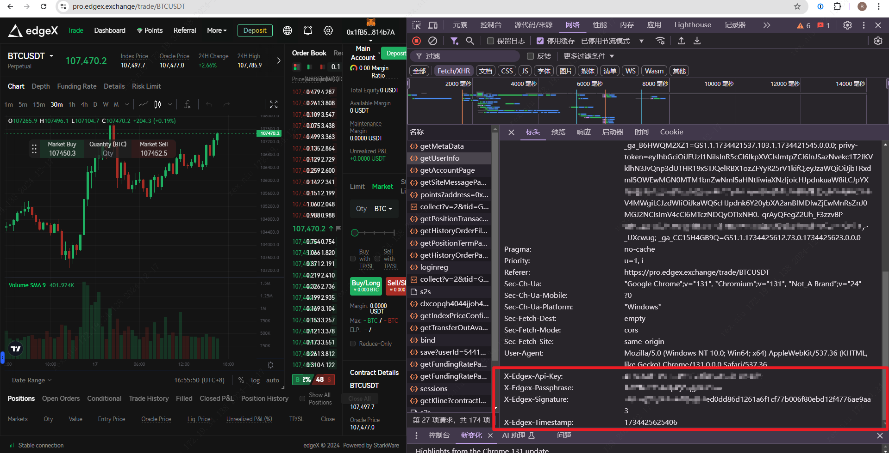

> **Warning:** This is a beta version and actively under development. Please open a ticket on [Discord](https://discord.com/invite/edgex) if you encounter any problems.


# User Authentication

## Domain

```text
https://pro.edgex.exchange
```

## Private API Auth Header

| Name               | Location | Type    | Required | Description              |
| ------------------ | -------- | ------- | -------- | ------------------------ |
| x-edgex-api-key    | header   | string  | must     | None                     |
| x-edgex-passphrase | header   | string  | must     | None                     |
| x-edgex-signature  | header   | string  | must     | None                     |
| x-edgex-timestamp  | header   | number  | must     | None                     |

> Login to [edgeX](https://pro.edgex.exchange/trade/BTCUSDT), copy the 4 request headers, and **Request The Administrator** to configure the user list to access the API interface.

<figure><figcaption><p><strong>How To GET Your Request Header</strong></p></figcaption></figure>

## Public API

```text
No authentication is required for public interfaces.
```


## Generate L2 signature

<figure><figcaption><p><strong>How To GET Your L2 Private Key</strong></p></figcaption></figure>


## Withdraw signature 

```text
position_id <==> user account_id
asset_id_collateral <==> meta_data.coinList.starkExAssetId
```

[WithdrawalToAddress](https://docs.starkware.co/starkex/api/perpetual/transactions.html#services.perpetual.api.gateway.transactions.WithdrawalToAddress)

###  Code Example

``` 
String getWithdrawalToAddressMsg({
  required String assetIdCollateral,
  required String positionId,
  required String ethAddress,
  required String nonce,
  required String expirationTimestamp,
  required String amount,
}) {
  var w1 = assetIdCollateral;
  var w5 = BigInt.from(withdrawalToAddress);
  w5 = (w5 << 64) + _toBigInt(positionId);
  w5 = (w5 << 32) + _toBigInt(nonce);
  w5 = (w5 << 64) + _toBigInt(amount);
  w5 = (w5 << 32) + _toBigInt(expirationTimestamp);
  w5 = w5 << 49;
  return pedersen([
    pedersen([w1, ethAddress]),
    w5.toRadixString(16)
  ]);
}
```


## Limit Order signature

```text
asset_id_synthetic <==> meta_data.contractList.starkExSyntheticAssetId
asset_id_collateral <==> meta_data.coinList.starkExAssetId
asset_id_fee <==> meta_data.coinList.starkExAssetId
```

[Limit order with fees](https://docs.starkware.co/starkex/perpetual/signature_construction_perpetual.html#limit_order_with_fees)

###  Code Example

```code
/// https://docs.starkware.co/starkex-v4/starkex-deep-dive/message-encodings/in-perpetual
String getLimitOrderMsg({
  required String assetIdSynthetic,
  required String assetIdCollateral,
  required bool isBuyingSynthetic,
  required String assetIdFee,
  required String amountSynthetic,
  required String amountCollateral,
  required String maxAmountFee,
  required String nonce,
  required String positionId,
  required String expirationTimestamp,
}) {
  final String assetIdSell;
  final String assetIdBuy;
  final String amountSell;
  final String amountBuy;
  if (isBuyingSynthetic) {
    assetIdSell = assetIdCollateral;
    assetIdBuy = assetIdSynthetic;
    amountSell = amountCollateral;
    amountBuy = amountSynthetic;
  } else {
    assetIdSell = assetIdSynthetic;
    assetIdBuy = assetIdCollateral;
    amountSell = amountSynthetic;
    amountBuy = amountCollateral;
  }
  final w1 = assetIdSell;
  final w2 = assetIdBuy;
  final w3 = assetIdFee;
  var msg = pedersen([w1, w2]);
  msg = pedersen([msg, w3]);
  var w4 = _toBigInt(amountSell);
  w4 = (w4 << 64) + _toBigInt(amountBuy);
  w4 = (w4 << 64) + _toBigInt(maxAmountFee);
  w4 = (w4 << 32) + _toBigInt(nonce);
  msg = pedersen([msg, w4.toRadixString(16)]);
  var w5 = BigInt.from(limitOrderWithFees);
  w5 = (w5 << 64) + _toBigInt(positionId);
  w5 = (w5 << 64) + _toBigInt(positionId);
  w5 = (w5 << 64) + _toBigInt(positionId);
  w5 = (w5 << 32) + _toBigInt(expirationTimestamp);
  w5 = w5 << 17;
  return pedersen([msg, w5.toRadixString(16)]);
}
```

## Transfer signature

[Transfer](https://docs.starkware.co/starkex/perpetual/signature_construction_perpetual.html#transfer_with_fees)

###  Code Example

```code
String getTransferMsg({
  required String assetId,
  required String receiverPublicKey,
  required String senderPositionId,
  required String receiverPositionId,
  required String srcFeePositionId,
  required String nonce,
  required String amount,
  required String expirationTimestamp,
  String assetIdFee = '0',
  String maxAmountFee = '0',
}) {
  final w1 = assetId;
  final w2 = assetIdFee;
  final w3 = receiverPublicKey;
  var w4 = _toBigInt(senderPositionId);
  w4 = (w4 << 64) + _toBigInt(receiverPositionId);
  w4 = (w4 << 64) + _toBigInt(srcFeePositionId);
  w4 = (w4 << 32) + _toBigInt(nonce);
  var w5 = BigInt.from(transfer);
  w5 = (w5 << 64) + _toBigInt(amount);
  w5 = (w5 << 64) + _toBigInt(maxAmountFee);
  w5 = (w5 << 32) + _toBigInt(expirationTimestamp);
  w5 = w5 << 81;
  var msg = pedersen([w1, w2]);
  msg = pedersen([msg, w3]);
  msg = pedersen([msg, w4.toRadixString(16)]);
  msg = pedersen([msg, w5.toRadixString(16)]);
  return msg;
}
```
