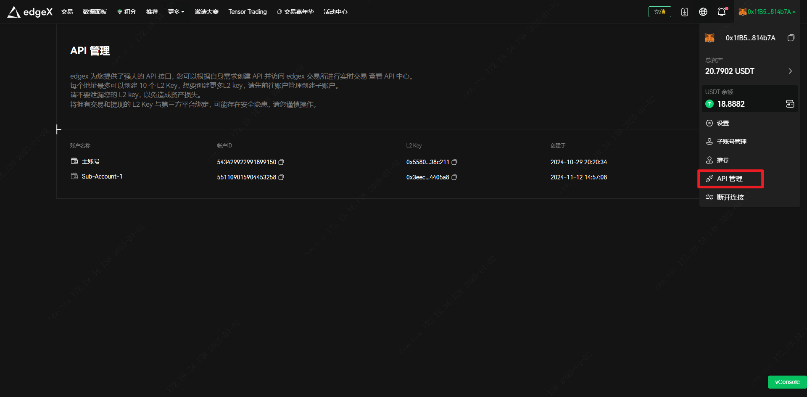

# API Authentication


## Domain

```text
https://pro.edgex.exchange
```

## Auth Header

| Name               | Location | Type    | Required | Description              |
| ------------------ | -------- | ------- | -------- | ------------------------ |
| `X-edgeX-Api-Timestamp` | header   | string  | must     | None                     |
| `X-edgeX-Api-Signature` | header   | string  | must     | None                     |


## Signature Elements

| **Signature Element**                  | **Description**                                                                 |
|----------------------------------------|---------------------------------------------------------------------------------|
| `X-edgeX-Api-Timestamp`                | The timestamp when the request was made. This is retrieved from the request header. |
| **Request Method (Uppercase)**         | The HTTP method of the request, converted to uppercase (e.g., GET, POST).        |
| **Request Path**                       | The URI path of the request (e.g., `/api/v1/resource`).                          |
| **Request Parameter/Body**             | The query parameters or request body, sorted alphabetically.                     |

### Request Parameter To Signature Content

>1735542383256GET/api/v1/private/account/getPositionTransactionPageaccountId=543429922991899150&filterTypeList=SETTLE_FUNDING_FEE&size=10


### Request Body To Body String

```java
      private static final String EMPTY_STRING = "";

    private static String getValue(JsonElement valueJson) {
        if (valueJson.isJsonNull()) {
            return EMPTY_STRING;
        } else if (valueJson.isJsonPrimitive()) {
            return valueJson.getAsString();
        } else if (valueJson.isJsonArray()) {
            JsonArray valueArray = valueJson.getAsJsonArray();
            if (valueArray.isEmpty()) {
                return EMPTY_STRING;
            }
            List<String> values = new ArrayList<>();
            for (JsonElement itemValue : valueArray) {
                values.add(getValue(itemValue));
            }
            return Joiner.on("&").join(values);
        } else if (valueJson.isJsonObject()) {
            TreeMap<String, String> sortedDataMap = new TreeMap<>();
            JsonObject valueJsonObj = valueJson.getAsJsonObject();
            for (String key : valueJsonObj.keySet()) {
                sortedDataMap.put(key, getValue(valueJsonObj.get(key)));
            }
            return sortedDataMap.keySet().stream()
                    .map(key -> key + "=" + sortedDataMap.get(key))
                    .collect(Collectors.joining("&"));
        }
        return EMPTY_STRING;
    }
```
## Signature Algorithm

**Ecdsa**


> [Python Signature Demo](https://github.com/starkware-libs/starkex-resources/blob/master/crypto/starkware/crypto/signature/signature_test.py#L62)

> [Java Script Signature Demo](https://www.npmjs.com/package/@starkware-industries/starkware-crypto-utils#signing-a-starkex-order)
 
### Java Implement Demo

``` java
import java.math.BigInteger;

import org.web3j.abi.TypeEncoder;
import org.web3j.abi.datatypes.Utf8String;
import org.web3j.abi.datatypes.generated.Uint256;
import org.web3j.crypto.Hash;
import org.web3j.utils.Numeric;

    public static final BigInteger K_MODULUS = Numeric
            .toBigInt("0x0800000000000010ffffffffffffffffb781126dcae7b2321e66a241adc64d2f");

    public static void main(String[] args) {
        String privateKeyHex = "0463ac809cc7d7c1baf*********************baff9fc6e3d8e5b160ea3fc";

        // 确保私钥是去掉 "0x" 前缀的十六进制字符串
        if (privateKeyHex.startsWith("0x")) {
            privateKeyHex = privateKeyHex.substring(2);
        }

        BigInteger mySecretKey = new BigInteger(privateKeyHex, 16);
        PrivateKey privateKey = PrivateKey.create(mySecretKey);

        String message = "1735542383256GET/api/v1/private/account/getPositionTransactionPageaccountId=543429922991899150&filterTypeList=SETTLE_FUNDING_FEE&size=10";
        String msg = TypeEncoder.encodePacked(new Utf8String(message));

        BigInteger msgHash = Numeric.toBigInt(Hash.sha3(Numeric.hexStringToByteArray(msg)));

        msgHash = msgHash.mod(K_MODULUS);

        Signature signature = Ecdsa.sign(msgHash, privateKey);

        String starkSignature = TypeEncoder.encodePacked(new Uint256(signature.r)) +
                TypeEncoder.encodePacked(new Uint256(signature.s)) +
                TypeEncoder.encodePacked(new Uint256(privateKey.publicKey().point.y));

        System.out.println(starkSignature);

    }

    public static Signature sign(BigInteger msgHash, PrivateKey privateKey) {
        Curve curve = privateKey.curve;
        BigInteger randNum = new BigInteger(curve.N.toByteArray().length * 8 - 1, new SecureRandom()).abs().add(BigInteger.ONE);
        Point randomSignPoint = EcMath.multiply(curve.G, randNum, curve.N, curve.A, curve.P);
        BigInteger r = randomSignPoint.x.mod(curve.N);
        BigInteger s = ((msgHash.add(r.multiply(privateKey.secret))).multiply(EcMath.inv(randNum, curve.N))).mod(curve.N);
        return Signature.create(r, s);
    }
```


## Signing Key

<figure><figcaption><p><strong>How To GET Your L2 Private Key</strong></p></figcaption></figure>