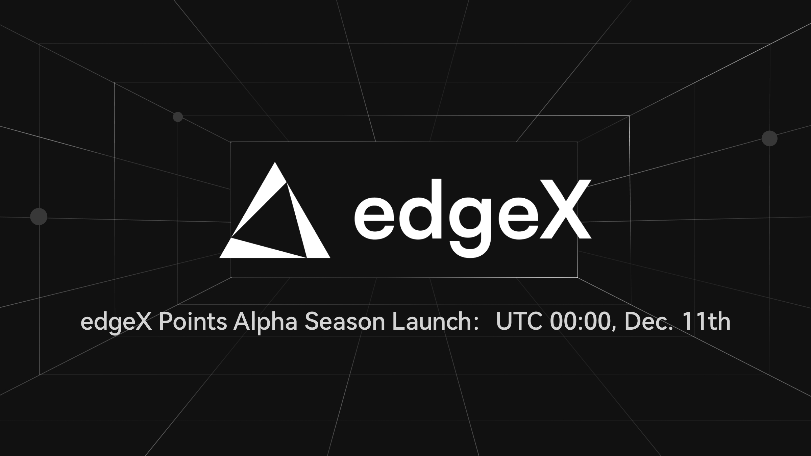

# Points

<figure><figcaption></figcaption></figure>

**edgeX Points**&#x20;

The edgeX Points program is designed to encourage genuine user engagement with edgeX products and to reward loyal users who actively contribute to the growth of the edgeX ecosystem.

**Points Allocation Criteria**

Points are awarded based on multiple performance metrics, including trading volume, referral trading volume, open interest, and frequency of feature usage. As the edgeX product suite and ecosystem continue to evolve, the criteria and weighting of these metrics may be adjusted accordingly.

**Referral Bonus**&#x20;

Referrers earn 1 point for every 4 points accumulated by their referred users.

**Weekly Distribution Schedule**&#x20;

Points are calculated weekly as of Wednesday at 00:00 UTC. Allocations are then distributed the following week at 08:00 UTC.

**Visit edgeX** [**Points Page**](https://pro.edgex.exchange/points)
